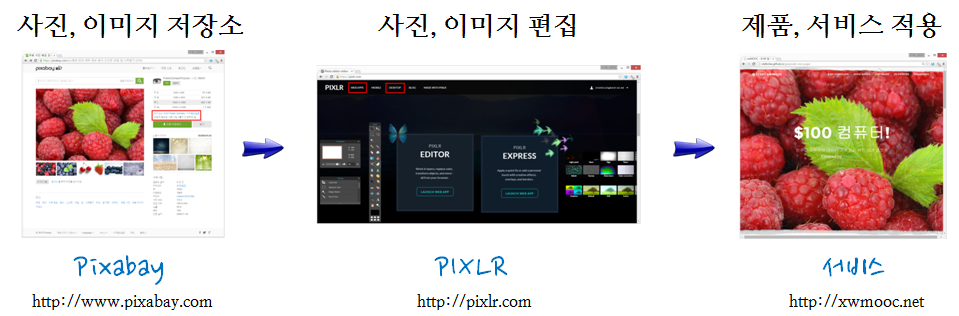

> ### 학습 목표 {.objectives}
>
> *  사진, 이미지를 서비스, 제품에 적용하는 과정을 이해한다.
> *  저작권에 자유로운 공개 인터넷 저장소를 검색하고, 쉽고 빠르게 사용가능한 그래픽 편집 소프트웨어를 검색한다.
> *  사진, 이미지 검색, 편집, 서비스 및 제품 적용 사례를 살펴본다.

### 1. 공개 이미지 파일 저장소

스타트업 사업을 하게 되면 교육기관에 소속될 때보다 각종 규제에 자유롭지 못하다. 일례로 교육기관에 속해있을 경우 사진, 이미지, 클립아트 등을 자유로이 보고서나 각종 발표자료에 상대적으로 제약없이 사용할 수 있었다면, 사업을 하게 되면 나중에 성공했을 때 저작권을 준수하지 않고 사용한 각종 사진, 이미지, 보고서, 통계 자료, 데이터 등이 발목을 잡을 수 있다. 사업 초기 저작권에서 자유로운 저장소를 적극 활용하는 것이 사업의 성공 가능성은 차치 하더라도 법률적인 위험에서 회피할 수 있게 도움을 줄 수 있다.

[pixabay](https://pixabay.com/) 웹사이트는 어디에서나 사용할 수 있는 무료 고품질 이미지를 제공하고 있다. 특히, 좌측 상단에 라이센스를 명시하고 있고 출처를 밝히지 않고 상업적 용도로 사용가능한 퍼블릭 도메인(Public Domain) 이미지가 다수 있으니 사업 목적에 맞는 적절한 사진, 이미지를 찾아 활용하는 것도 좋은 전략이다.

### 2. 이미지 편집

공개 사진 이미지를 파일을 찾아서 다운로드 받았으면 이미지를 편집할 수 있는 소프트웨어가 필요하다. 편집을 통해서 문구를 삽입하고, 분위기를 맞추고, 크기를 조절하고, 필요하면 다른 사진 이미지와 조합을 하는 등 작업이 필요하다. 이 목적을 위해서 다양한 소프트웨어가 상업적, 공개 무료 소프트웨어, 광고와 연계된 조건부 무료 소프트웨어 등 다양한 이미지 핀집 도구가 시장에 나와있다.

사업 목적에 맞춰 적절한 도구를 선택해서 사용하면 된다. 오토데스크 회사에서 제작한 [PIXLR](https://pixlr.com/) 이미지 편집 소프트웨어 제품, 서비스도 사용을 검토할만하다. 소프트웨어를 굳이 설치하지 않고도 **WEB APPS** 방식으로 사진 이미지 편집을 직관적이며 쉽게 작업할 수 있는 점이 좋다.

### 3. 제품, 서비스에 사진, 이미지 적용

공개 사진, 이미지 특화 저장소에서 적합한 이미지를 다운로드 받아 이미지 편집 툴을 사용해서 개발을 완료했으면 제품, 서비스 목적에 맞춰 적용하여 활용한다.